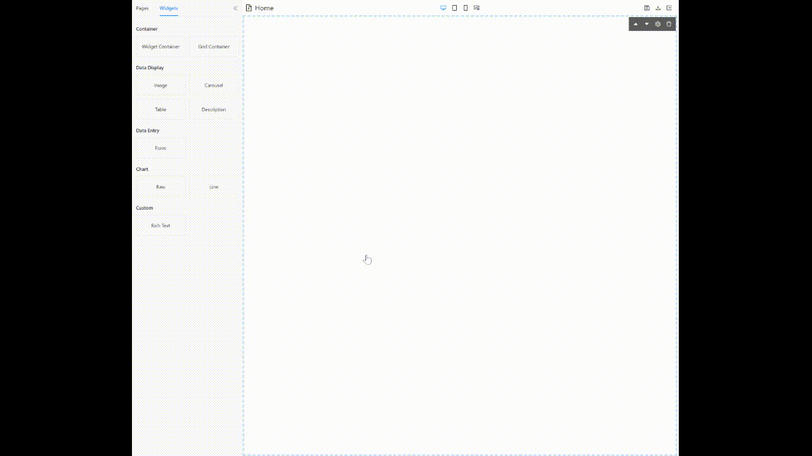
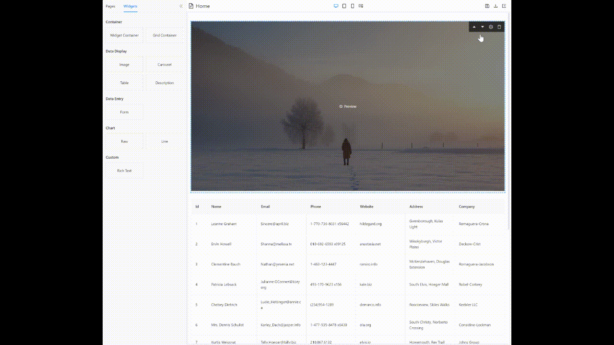
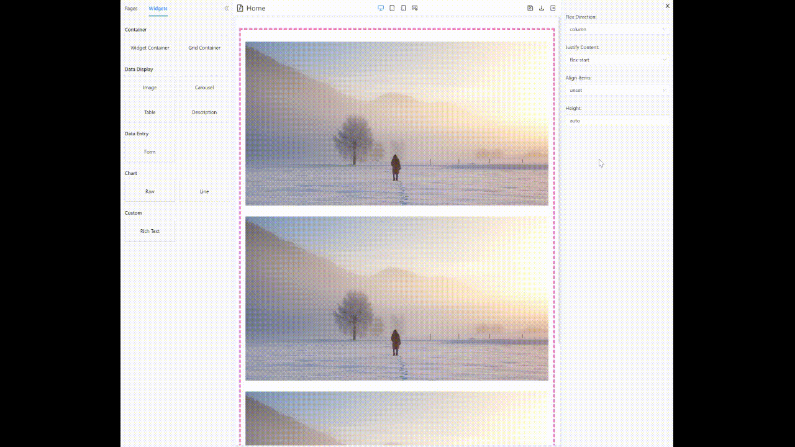
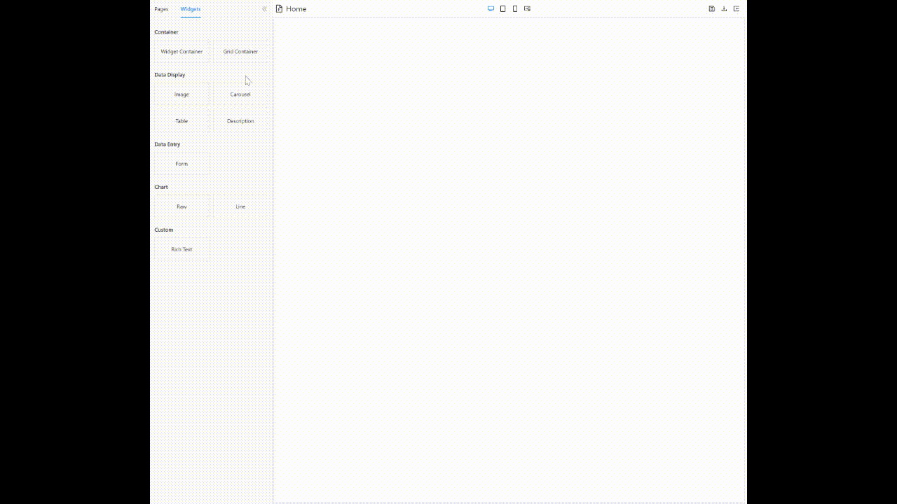
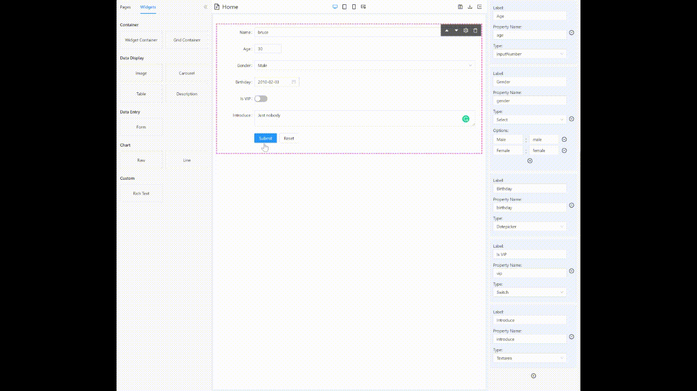
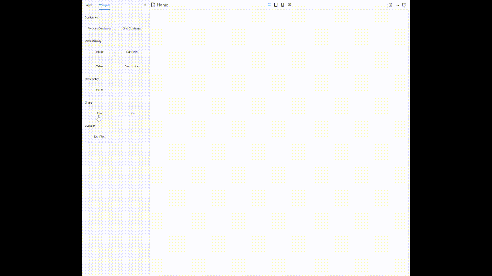
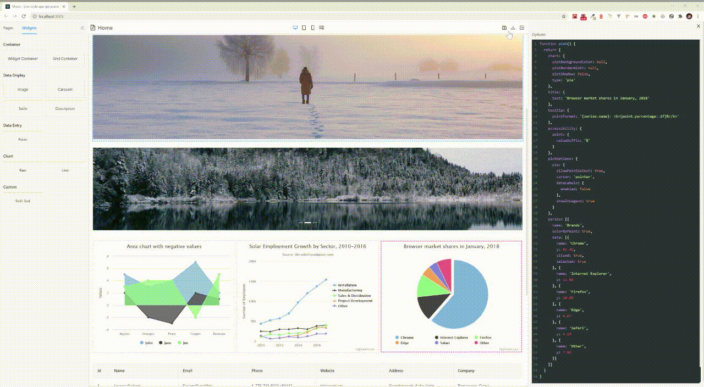
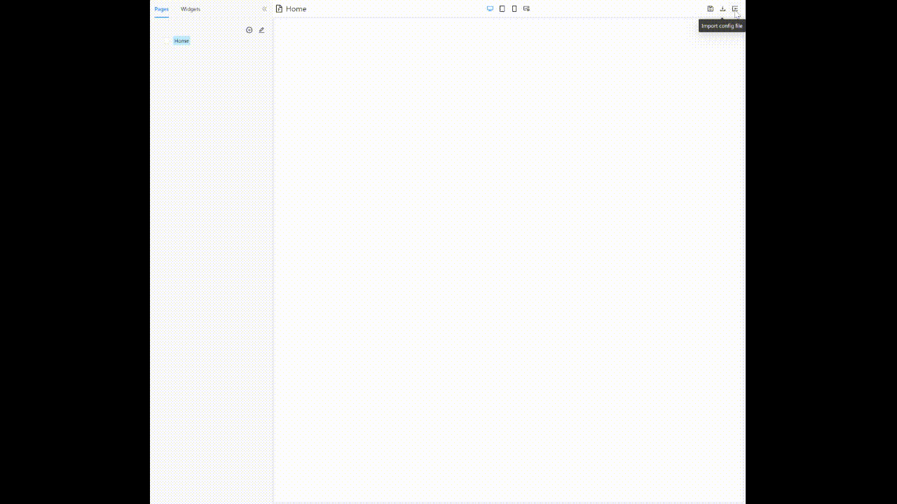

春节期间在家闲来无事，开发了一个可视化的低代码开发平台，在此分享给大家。

项目取名为 [Moria](https://en.wikipedia.org/wiki/Moria_(Middle-earth))，原意为托尔金的小说中矮人在中土世界建立的庞大地下城市，包含巨大的坑道网络、屋室、矿坑及大殿。在此象征该平台可构建业务复杂的庞大应用（离目标还有点远）。

项目目前只开发出了UI层，数据层和服务层已有相应的开发计划。

目前前端主要功能有：

### 1. 拖拽组件构建页面

### 2. 组件配置即时生效

### 3. Flex, Grid容器布局

**Flex:**

**Grid:**

### 4. 表单创建提交

### 5. Highcharts 图表展示

### 6. 富文本页面创建

### 7. 应用配置导入导出

**导出配置：**

**导入配置：**

项目地址：https://github.com/MudOnTire/moria

项目鸣谢：

> 感谢 [Ant Design](https://ant.design/index-cn) 优秀的组件库

> 感谢[@margox](https://github.com/margox)优秀的富文本编辑器 [braft-editor](https://github.com/margox/braft-editor)

> 感谢优秀的Web code editor [CodeMirror](https://github.com/codemirror/CodeMirror)

> 感谢优秀的图表库 [Highcharts](https://github.com/highcharts/highcharts)
